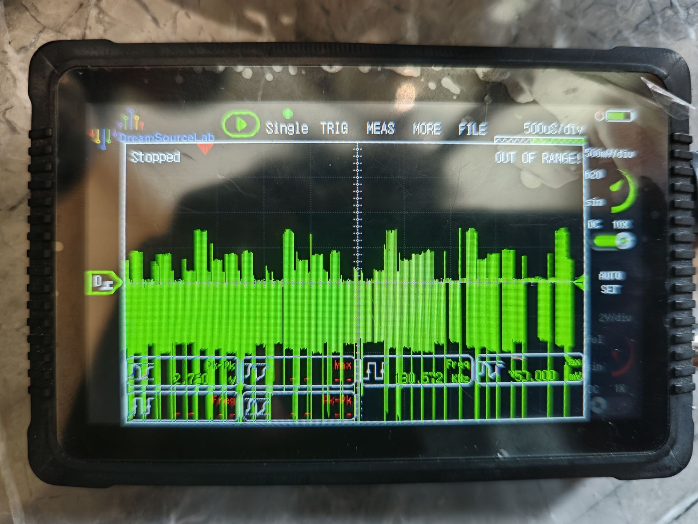
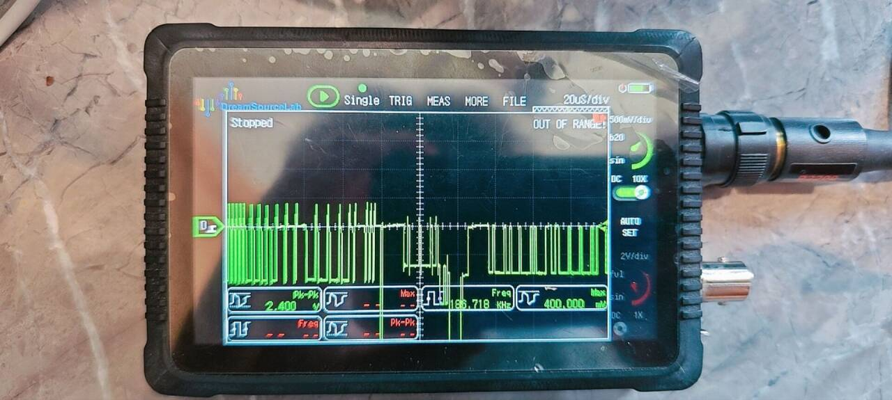
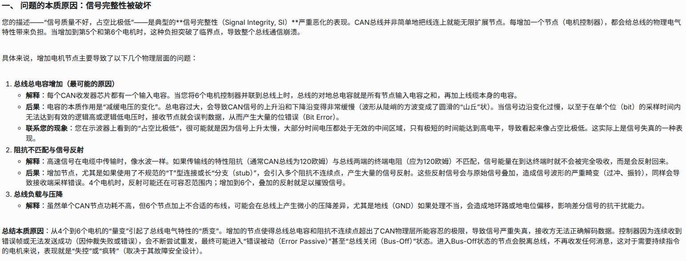

2025 Robocon 我们的R2底盘在比赛前十几分钟才排查出问题，来不及调参就被拉上场，最终也没能展示出它真正的实力，还有机械和电控辛苦一年的成果（汗    
而这个问题，就是一条CAN总线上接了6个电机，导致CAN信号质量依托，电机一上电就疯转（最致命的是这个现象时有时无），把CAN1上的两个电机移到CAN2上就一切正常了（CAN2虽然此时也有6个电机了，但并不会同时发消息）。    
使用示波器测量结果如图：    

    
   
受到这次失败，我发现我对于CAN通信这个极其常用的通信方式并没有很好的了解，于是决定较为系统的学习CAN通信，以及其他的相关内容，坚持努力充实技术栈    
***    
大致的学习内容规划：    
1. 学习CAN通信的基础原理、协议具体内容、特点
2. CAN的硬件层
3. 学习示波器的使用和原理