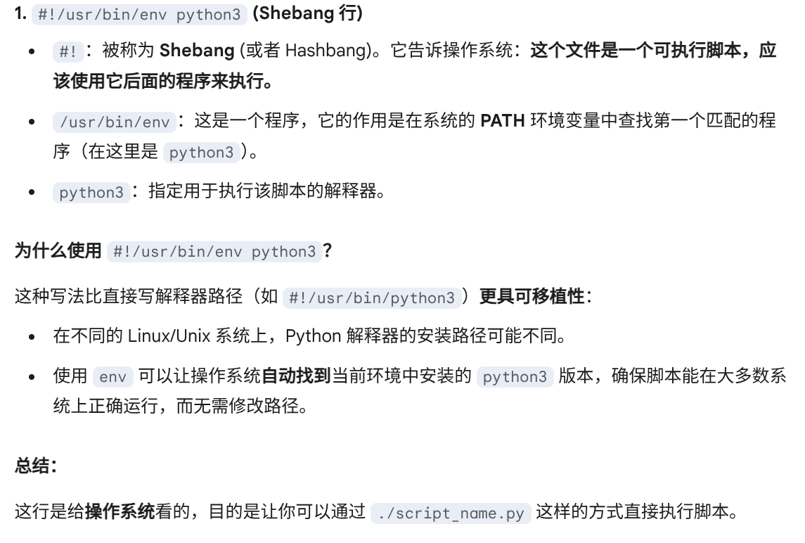

## 一、小东西 
1. 转义字符：右斜杠`\`
2. 保留整数的除法：`//`     

3. 文件开头    

```
#!/usr/bin/env python3
# -*- coding: utf-8 -*-
```
     

4. f-string：
```
a=1.123456
print(f"保留两位小数r = {r:.2f}")
```    
  
5. `range(x)`：0 ~ x-1的整数序列


## 二、数据类型
### 1. list (可变)
`stu = ['Michael', 'Bob', 'Tracy']`     

1. 索引： stu[0] , stu[1] , stu[-1] , stu[-2] . . .    
2. 末尾追加：`stu.append('Adam')`
3. 插入指定位置：`stu.insert(1, 'Jack')`
4. 删除指定位置：`stu.pop(1)`    

### 2. tuple (不可改变元素)
`stu = ('Michael', 'Bob', 'Tracy')`    

### 3. dict 
```
>>> d = {'key':value}
>>>d['key']
value
```    
**dict的key必须是不可变对象**
1. 查询value：`d.get('key')`
2. 删除key：`d.pop('key')`

### 4. set
`s = {1, 2, 3}`    
**重复元素在set中自动被过滤**
1. 添加元素：`s.add(4)`
2. 删除元素：`s.remove(4)`
3. 交 / 并操作：
```
>>> s1 = {1, 2, 3}
>>> s2 = {2, 3, 4}

>>> s1 & s2
{2, 3}

>>> s1 | s2
{1, 2, 3, 4}
```
set和dict的唯一区别仅在于没有存储对应的value

## 三、 判断与循环
### 1. if
```
if <条件判断1>:
    <执行1>
elif <条件判断2>:
    <执行2>
elif <条件判断3>:
    <执行3>
else:
    <执行4>
```    
### 2. 循环
```
for x in ...:
    <执行...>
```
for x in ...循环就是把每个元素代入变量x，然后执行缩进块的语句

### 四、 函数
#### 1. 定义函数
```
def my_abs(x):
    if x >= 0:
        return x
    else:
        return -x
```    
#### 2. 返回多个值
```
import math

def move(x, y, step, angle=0):
    nx = x + step * math.cos(angle)
    ny = y - step * math.sin(angle)
    return nx, ny
```    
本质是返回一个tuple，接受返回值时按照位置顺序接收：`x ,y = move(...)`
#### 3. 默认参数
```
def power(x, n=2):
    ...
```
**默认参数必须指向不变对象，否则多次调用会改变默认参数的值**

#### 4.可变参数 (传入0个或任意个参数)    
可变参数在函数调用时自动组装为一个tuple
```
def calc(*numbers):
    sum = 0
    for n in numbers:
        sum = sum + n * n
    return sum
```    
使用方法一：  
`calc(1, 2, 3)`    
使用方法二：    
```
>>> nums = [1, 2, 3]
>>> calc(*nums)
```
nums表示把nums这个list的所有元素作为可变参数传进去

#### 5. 关键字参数 (传入0个或任意个含参数名的参数)   
关键字参数在函数内部自动组装为一个dict     
```
def person(name, age, **kw):
    print('name:', name, 'age:', age, 'other:', kw)
```    

```
>>> person('Michael', 30)
name: Michael age: 30 other: {}

>>> person('Adam', 45, gender='M', job='Engineer')
name: Adam age: 45 other: {'gender': 'M', 'job': 'Engineer'}
```     
使用方法一：    
```
>>> extra = {'city': 'Beijing', 'job': 'Engineer'}
>>> person('Jack', 24, city=extra['city'], job=extra['job'])
name: Jack age: 24 other: {'city': 'Beijing', 'job': 'Engineer'}
```    
使用方法二：
```
>>> extra = {'city': 'Beijing', 'job': 'Engineer'}
>>> person('Jack', 24, **extra)
name: Jack age: 24 other: {'city': 'Beijing', 'job': 'Engineer'}
```     

#**命名关键字参数**
```
def person(name, age, **kw):
    if 'city' in kw:
        # 有city参数
        pass
    if 'job' in kw:
        # 有job参数
        pass
    print('name:', name, 'age:', age, 'other:', kw)
```
